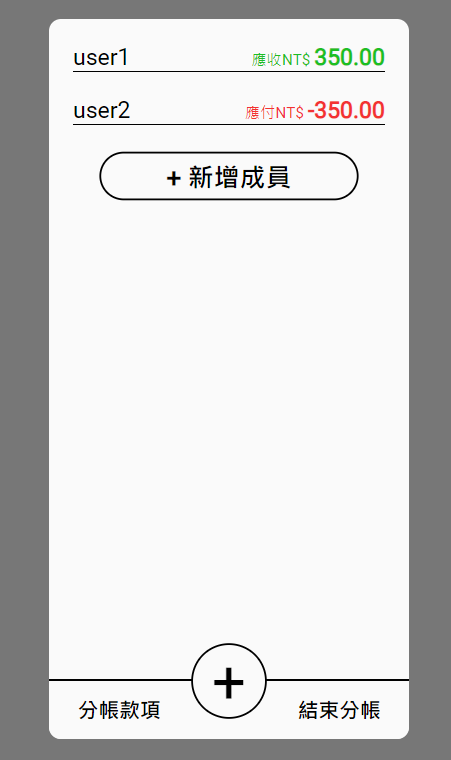
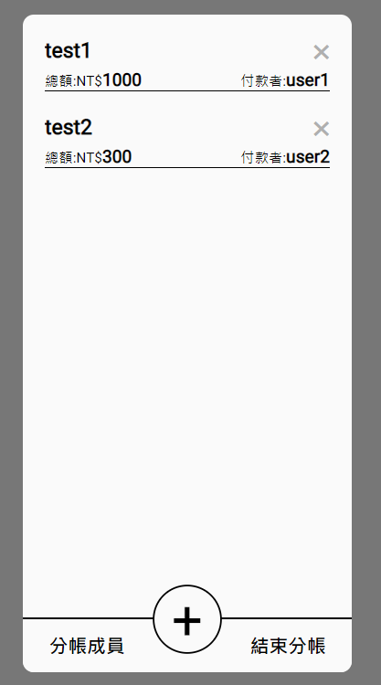

# Bill Split
分帳成員

分帳款項

## Demo
[demo](https://littleplumule.github.io/bill-split/)

## Description
若是多人出遊時需要分帳時就可使用此 APP

使用 Vite + Vue3 Composition API 製作

功能：
- 新增使用者
- 新增款項
- 顯示應收/應付的價格
## Clone
`git clone https://github.com/littlePlumule/bill-split.git`

`cd bill-split`

`npm install`

## Run
`npm run dev`